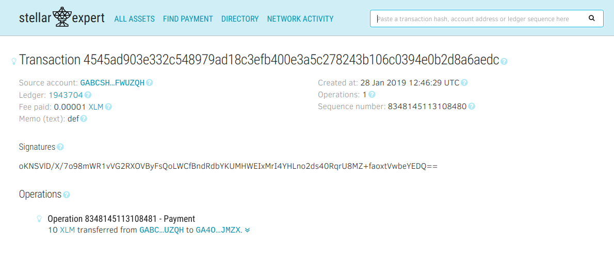

## What is StellarBurrito?

StellarBurrito is a package available on npm.

This package’s aim is to simplify the use of **stellar-sdk** thanks simplified calls to the core library.

This project is open source and opens to PR so if you want to help take a look at[ the GitHub project](https://github.com/andreaborio/stellarburrito)!

This tutorial works on test-net, currently this library isn’t suitable for production use.

### Let’s start

First of all, we need to create the project

```
$ mkdir Medium-Pay
$ cd Medium-Pay/
$ touch index.js
$ npm init
```

Then install stellar burrito package from npm

```
$ npm i stellarburrito --save
```

**Now our project should be initialized properly!**

Do you already have two accounts for making this payment? If you don’t have these follow this [tutorial](https://medium.com/@andrea.borio/create-new-account-on-stellar-using-stellarburritojs-27a34d759a78).

**Let’s start coding!**

First of all, we need to import stellar burrito in our project

```
const sb = require('stellarburrito')
```

Now we need 2 accounts for this payment:

**Alice**: the **sender** of our payment.

**Bob**: the **receiver** of the payment.

We need **Alice’s Private Key** for signing the transaction and **Bob Public Key** as the receiver address.

```
const sb = require('stellarburrito')
let alice = 'SC57...ZJF3'
let bob = 'GA40...JMZX'
```

The private key of Alice and the Public Key of Bob

## Almost Done!

Now let’s call and handle the response of **Pay** function, passing

**sender** (Alice’s Private Key)

**receiver** (Bob’s Public Key)

**amount** (in this case **10** XLM)

as shown here:

```
sb.paymentOperations.Pay(alice, bob, '10')
   .then(result => {
     console.log('Payment Processed!\n\r'+result.hash)
   })
   .catch(error => {
     console.log('Error!!!')
   })
```

So your code should look like this:

```
const sb = require('stellarburrito')
let alice = 'SC57...ZJF3'
let bob = 'GA40...JMZX'

sb.paymentOperations.Pay(alice, bob, '10')
   .then(result => {
     console.log('Payment Processed!\n\r'+result.hash)
   })
   .catch(error => {
     console.log('Error!!!')
   })
```

## Let’s try!

```
$ node index.js
```

The result:

```
Payment Processed!
4f9831f620cc72551e578bfccc695c952ec25cb667e131f4c53ebe84327923c0
```


You can verify the transaction simply copying the printed hash and pasting it on stellar.expert:



That’s it!

Thanks for your attention!
