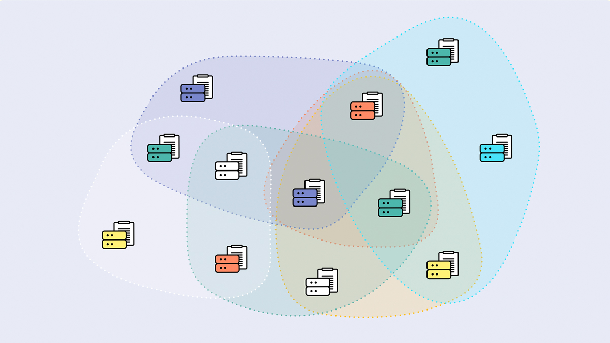
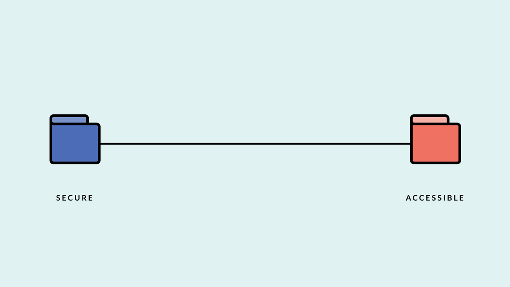
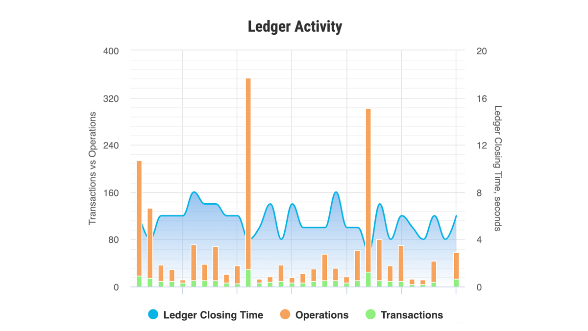
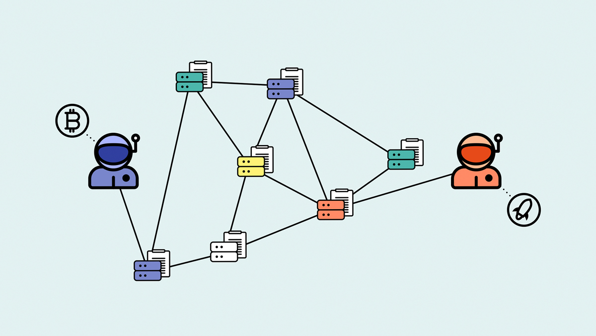
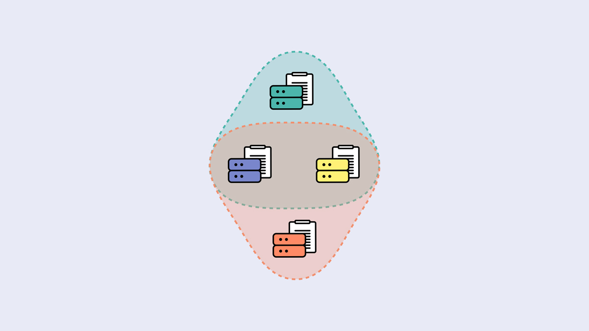

Get started by learning more about the Stellar network, how to store lumens, how to trade on the Stellar decentralized exchange, and more.

## Take the free course
Watch our series of animated videos that explain core Stellar concepts. The course covers nodes, the ledger, assets, anchors, accounts, transactions, the decentralized exchange, the Stellar Consensus Protocol, and more.

[Watch the videos](./course.md)

## Get network access
To start experimenting on and learning more about the Stellar network, use an exchange to buy lumens. This is not investment advice.

[Exchange list](https://coinmarketcap.com/currencies/stellar/#markets)

## Store lumens
You keep your savings in harder-to-use, more secure accounts, and you keep your spending cash in a less secure, easier-to-access location. Use a similar approach to stay secure on Stellar.

[Wallet security](./guides/how-to-store-lumens)

## Explore the ledger
Use a ledger explorer to look up accounts and transactions and explore the network. StellarExpert is a mobile-friendly ledger explorer and analysis platform with detailed asset stats, retrospective analysis, and charts.

[Visit StellarExpert](https://stellar.expert/)

## Trade on the Stellar DEX
Use the Stellar decentralized exchange (DEX) to trade peer-to-peer - from currencies like bitcoin to Euros to Chinese Yuan to one of the thousand tokens on the network - all for free and with fiat on ramps. You can use one of many user interfaces to access the DEX - StellarX, Stellarport, StellarTerm, and more.

[Trade on StellarX](https://www.stellarx.com/)

## Read the SCP White Paper
Study how the Stellar network reaches consensus every 3-5 seconds via the Stellar Consensus Protocol, or Federated Byzantine Agreement.

[Read the white paper](https://www.stellar.org/papers/stellar-consensus-protocol.pdf)
